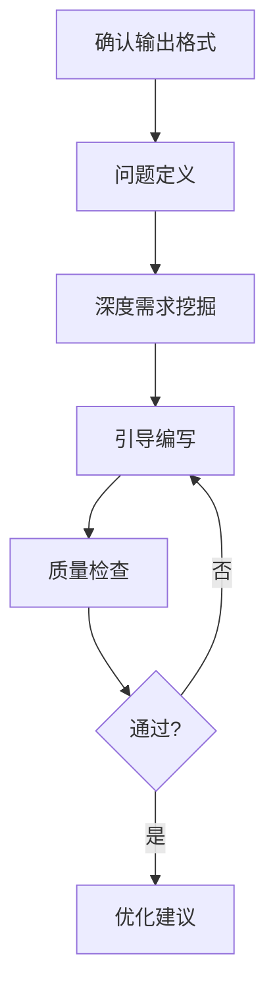
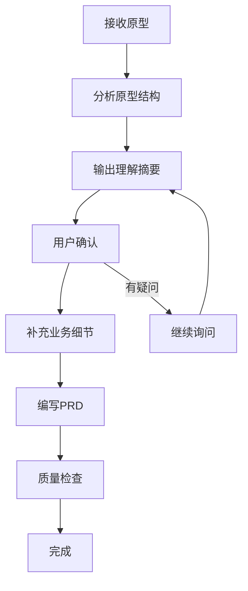

# TRS系统-功能设计文档编写

## Overview

本Skill指导用户编写符合企业级标准的TRS系统功能设计文档。基于企业顾问团队标准，融合GitHub热门PRD模板最佳实践。

**核心原则：** 证据优于断言，验证先于结论。

## Output Contract（输出约定）

最终交付的文档至少满足下面“最小可用规格”（信息不足允许先以假设补齐，但必须显式标注“假设/待确认”）：

- **范围**：In Scope / Out of Scope / Non-goals
- **用户与价值**：用户画像、使用场景、成功指标（SMART + 基线值 + 目标值 + 衡量方法 + 时间周期）
- **业务与流程**：现状流程、目标流程（含异常流程/回退/补偿）
- **功能拆分**：功能列表、用户故事、每个故事的验收标准（Given/When/Then 或清单式）
- **详细设计**：页面/接口/数据项（字段、控件、必填、值列表、级联、默认值、校验、报错）

> **接口契约写法规范（面向业务+开发双读者）：**
>
> 功能设计文档面向业务理解与功能验收，不承担技术接口设计职责。接口章节仅写业务契约：
>
> 1. **操作总览表**（5列）：序号 / 操作名称 / 触发时机 / 业务含义 / 业务校验规则
> 2. **每个操作**：用途说明 + 字段含义表（不用JSON）+ 业务校验规则（用自然语言）
> 3. **不展示**：HTTP方法、URL路径、原始JSON请求/响应、技术响应码、数据库表结构
>
> 技术实现（接口路径设计、参数类型定义、错误码体系、数据库方案）由后端工程师在技术设计文档中另行编写，不属于功能设计文档的范畴。
- **非功能需求**：性能、权限与数据安全、审计与留痕、兼容性、监控与日志
- **风险与依赖**：系统依赖、数据依赖、外设依赖（扫码枪/打印机/采集设备）、关键风险与缓解
- **发布与验收**：试点/灰度、回滚、培训、数据迁移（如有）、验收与复盘

> **红线**：不得用“应该/尽量/支持/优化”等模糊词代替可验证标准；关键声明必须给出验证方法或证据来源。

## When to Use

**使用场景：**

| 场景 | 说明 | 触发关键词 |
|------|------|-----------|
| **传统需求沟通** | 用户口头描述需求，通过5W1H深度挖掘 | "我需要一个XX功能" |
| **原型驱动（推荐）** | 用户提供HTML/图片等原型，先理解原型再写PRD | "给你原型"、"看这个设计" |
| **文档优化** | 优化或重构现有功能设计文档 | "优化文档"、"改版" |
| **模板查询** | 询问文档模板或编写规范 | "模板"、"怎么写" |

**不适用于：**
- 纯技术实现方案（使用专门的技术设计skill）
- 架构设计文档（使用架构设计skill）

## The Iron Law

```
未经验证的文档声称完整 = 作弊，不是效率
```

**违反这条规则的借口** | **现实**
"我凭经验写就行" | 经验不等于规范，需要逐项确认
"这功能简单，跳过检查" | 越是简单功能越容易忽略关键细节
"时间紧，先写再说" | 返工的时间比预防的时间更长
"差不多就行了" | 开发人员会问你补充细节

## Core Workflow

本skill支持两种工作模式：**传统需求沟通** 和 **原型驱动（推荐）**。

### 模式A：传统需求沟通



适用于用户口头描述业务需求，通过5W1H框架深度挖掘。

### 模式B：原型驱动（推荐）⭐

适用于用户提供HTML/图片/Figma等原型设计。



**详细说明** → 见 [reference/prototype-driven.md](reference/prototype-driven.md)

### 如何选择模式

| 条件 | 推荐模式 |
|------|---------|
| 用户提供了原型文件 | **原型驱动** |
| 用户口头描述需求 | 传统需求沟通 |
| 用户说"给你原型先看看" | **原型驱动** |
| 用户问"PRD模板怎么写" | 传统需求沟通 |

### Step 0: 识别工作模式 & 确认输出格式

**首先判断用户属于哪种场景：**

**场景1：用户提供原型**
- 触发：用户提供了HTML/图片/Figma文件，或说"给你原型"
- 动作：**直接进入原型驱动流程**（见下方）

**场景2：用户口头描述需求**
- 触发：用户描述业务需求
- 动作：进入传统需求沟通流程（Step 1 → Step 2...）

**输出格式：** 默认输出 **Markdown 格式**。如需导出为 Word，完成编写后按以下方式转换：

1. **首选：pandoc 直接转换**（本 Skill 自带 `reference.docx` 模板，无需额外 skill）
   ```bash
   # 基础转换
   pandoc input.md -o output.docx
   # 使用 SIE 模板 + 自动目录
   pandoc input.md --reference-doc=reference.docx --toc --toc-depth=3 -o output.docx
   ```
   > 若环境已安装 `md-to-office` skill（同样基于 pandoc），可优先使用；否则直接用上述 pandoc 命令即可，二者产物一致。
2. **备选：使用内置 `docx` skill** 直接生成 .docx（格式控制更精确，适合定制需求）

---

## PRD自检质控门（写作中实时评估）

在编写PRD的每个关键节点，AI主动触发自检评估。**目标：写出清晰、无歧义、可执行的文档；识别自身无法填补的缺口，显式标注给产品经理。**

### 触发时机

在完成以下章节后，**自动触发自检**，不必等用户提醒：

| 完成节点 | 触发时机 |
|---------|---------|
| 第4章 问题定义与用户画像 | 用户画像/使用场景/成功指标 写完后 |
| 第5章 概述 | 现状流程/目标流程 写完后 |
| 第6章 总体设计 | 功能清单全部列出后 |
| 第7章 详细设计 | 所有页面/接口/数据项写完后 |
| 全文初稿 | 文档主体完成后、提交前 |

### 评估维度（5维度，各20分，满分100）

| 维度 | 评估问题 | 扣分触发条件 | 最低分 |
|------|---------|------------|--------|
| **① 完整性** | 所有"最小可用规格"章节是否齐备？ | 任意必填章节缺失 → -10/处 | 8 |
| **② 无歧义** | 字段描述、流程分支、状态值是否有二义性？ | 存在"可能"/"大概"/"视情况"等模糊词 → -3/处，上限-12 | 8 |
| **③ 可追踪** | 功能 → 验收标准 → 详细设计三者是否对齐？ | 功能在验收标准和详细设计中找不到对应项 → -8/处 | 8 |
| **④ 一致性** | 跨章节字段名/状态值/操作名是否统一？ | 同名不同义 或 同义不同名 → -4/处，上限-12 | 8 |
| **⑤ 完整性-数据项** | 数据项表格的必输/新增/编辑列是否填写？值列表是否有来源？ | 任意行留空（"-"以外的空白）→ -3/行，上限-12 | 8 |

> **评分锚定规则：** 每维度设最低分 8 分（不低于），单项扣分有上限（防止因同类问题堆积导致该维度归零）。

### 评分等级

| 总分 | 等级 | 处置动作 |
|------|------|---------|
| 90-100 | 🟢 优秀 | 直接提交，可选标注"亮点章节" |
| 70-89 | 🟡 良好 | AI自行修复所有"可自完善"项，修复后重评，剩余问题标注给PM |
| 50-69 | 🟠 需改进 | 修复明显缺口，剩余问题全部写入"假设与待确认"表，告知PM |
| < 50 | 🔴 不合格 | 先说明核心缺口在哪，列出补充方向，请PM提供信息后再继续 |

### 自完善 vs. 标注PM 的判断规则

**AI自行修复（能修则修）：**
- 字段描述歧义 → 用更精确的描述替换
- 字段名/状态值前后不一致 → 统一为最新出现的命名，并全局替换
- 数据项表格留空 → 联系上下文推断合理的默认值/校验规则，以**假设**形式补充并加注说明
- 缺少验收标准 → 根据功能描述自行推导3条Given/When/Then格式验收标准

**必须标注PM（不能自填）：**
- 涉及业务决策：如"优先级怎么定"、"由谁审批"、"超时阈值"
- 涉及外部依赖：第三方系统接口、数据来源不在团队内
- 涉及特殊权限：哪些角色能做/不能做未经明确授权的操作
- 业务规则无文档支撑：无法从上下文推断的数值/逻辑

**标注格式（写入文档"假设与待确认"表）：**

```markdown
| 待确认项 | 章节 | 缺失原因 | 影响范围 | 优先级 |
|---------|------|---------|---------|--------|
| 优先级P0/P1/P2的划分标准是什么？ | 6.4功能列表 | 业务决策，需PM确认 | 影响开发排序 | 高 |
| 催收短信的发送频率上限？ | 7.4操作说明 | 外部合规要求，不在需求范围内 | 影响功能边界 | 中 |
```

### 质控门输出格式

每次自检完成后，在文档末尾追加质控报告（不删除历史报告，保留演进痕迹）：

```markdown
## 质控报告（自动生成）

**自检时间：** YYYY-MM-DD HH:mm
**触发节点：** [章节名]
**评估总分：** X / 100（[等级]）
**本次自检修复：** [N] 项（详见下方列表）
**待PM确认：** [N] 项（已写入"假设与待确认"表）

#### 本次修复清单
- ① [修复项内容] → [修复方式]

#### 本次待确认清单
- ❓ [待确认问题] → [影响章节] → [优先级]

---
```

### 注意事项

- 质控门是**写作者的内部质量动作**，不替代PM的正式审阅
- 不要在质控报告中重复文档已有的内容，只报告**缺口和修复结果**
- 评分不是目的，**让文档可执行**才是目的；遇到拿不准的，宁可多标注、少猜测

---

## 快速开始：原型驱动流程

当用户提供原型时，按以下步骤执行：

### 快速流程图

```
接收原型 → 读取分析 → 输出理解摘要 → 用户确认 → 补充细节 → 编写PRD
```

### Step P1: 接收并读取原型

**读取规则：**
- HTML文件：读取完整源码（HTML+CSS+JS）
- 图片文件：描述看到的UI元素、布局、文字
- 标注：字段名、按钮文字、状态值、颜色含义

### Step P2: 分析并输出理解摘要

**必须输出的内容：**

```markdown
## 原型理解摘要

### 页面关系
（列出所有页面的跳转关系）

### 功能清单
（用表格列出识别到的功能点，标注确认状态）

### 不确定项
（原型无法确定的内容，用❓标记）
```

**不理解的内容，必须标注❓，不得跳过**

### Step P3: 向用户确认

**必须询问的问题：**
1. 业务背景：这套系统的业务目的是什么？
2. 功能边界：原型中跳转/按钮的具体行为？
3. 状态逻辑：状态变更后的处理逻辑？
4. 异常处理：边界条件和错误情况？

**询问原则：**
- 优先问"会改变设计"的问题
- 每轮不超过5个问题
- 用开放式问题

### Step P4: 补充业务细节

基于用户回答，补充：
- 成功指标
- 异常处理
- 集成关系
- 审计留痕

### Step P5: 编写PRD文档

按照标准模板编写，**标注来源**：
- 原型已体现 → 标注"见原型"
- 询问补充 → 标注"用户确认"

---

### Step 1: 先收集"最小输入集"（避免空写）

在进入正文编写前，优先收集下面信息（缺少则记录为“假设 + 待确认问题”，并在相关章节引用）：

- **业务与边界**：业务域/工厂/组织范围、涉及产品/物料范围、追溯粒度（批次/箱/件/序列号）、时间范围
- **主链路**：正向/反向追溯链路、关键节点（采购/入库/生产/检验/包装/出库/客户）
- **数据与编码**：批次/条码/序列号规则、标签打印与贴标规则、扫码采集点位与频率
- **系统集成**：ERP/MES/WMS/QMS/PLM 的主数据与事件数据来源、接口方式（API/文件/消息）、责任方
- **合规与审计**：审计留痕要求、记录保留年限、数据更正机制、权限与职责分离
- **目标与指标**：召回演练时限（例如 X 分钟出具谱系与出货清单）、准确率/覆盖率/时效

### Step 2: 问题定义与价值验证（V2.0新增）

使用**5W1H框架**深度挖掘：

```
Why (为什么)    → 业务背景、痛点、数据支撑
What (是什么)   → 核心问题、影响范围
Who (谁)        → 提出者、使用者、影响者
When (何时)     → 使用场景、频率、期望上线
Where (在哪里)  → 系统、设备
How (如何)      → 解决方案、替代方案
```

**必问要素：**
- 用户画像（角色、痛点、典型场景）
- 成功指标（符合SMART原则）
- 数据支撑（错误率、处理时间等）

> 📐 **配套工具：** 使用 [工具4: 5W1H模板](reference/tools.md#工具4-问题定义模板5w1h) 结构化问题定义；使用 [工具5: 成功指标模板](reference/tools.md#工具5-成功指标模板) 确保 SMART 达标；使用 [工具3: 用户旅程图](reference/tools.md#工具3-用户旅程图模板) 梳理体验痛点。

### Step 3: 深度需求挖掘

**核心功能询问：**
- 查询/新增/编辑/删除/导出/上传
- 每个子功能的字段、控件、校验

**TRS系统领域补充（必须覆盖其一或明确"不适用"）：**
- 追溯谱系（Lot Genealogy）：拆分/合并/转产/返工/报废的多对多关系与口径
- 召回与演练（Mock Recall）：影响范围计算、库存/在制/在途/已出货清单、证据包导出
- 质量放行/冻结：检验结论与状态流转、隔离区、解冻审批
- 条码/标签：码制、校验、打印模板、补打/作废、盘点与对账
- 审计留痕：谁在何时因何更改了什么（含前后值）、更正/冲销机制
- 集成与一致性：主数据、事件数据、幂等/重放、延迟与补偿

> 📐 **配套工具：** 使用 [工具1: SMART指标检查器](reference/tools.md#工具1-smart指标检查器) 验证指标合理性；使用 [工具2: 风险评估矩阵](reference/tools.md#工具2-风险评估矩阵) 评估需求风险；追溯领域参考 [追溯领域模板](reference/traceability-domain.md)。

**字段设计询问框架：**
```
1. 字段名称？
2. 控件类型？（文本、下拉、日期、数值）
3. 必填？
4. 值列表来源？（取表/快码/手工）
5. 级联关系？（选A后B取什么）
6. 校验规则？（格式、长度、重复）
7. 报错信息？（明确字段+修改建议）
```

**数据项表格规范（最佳实践）：**

数据项表格必须使用以下12列格式，禁止简化列头：

```markdown
| 序号 | 字段名 | 控件类型 | 数值类型 | 长度 | 必输 Y/N | 新增 Y/N | 编辑 Y/N | 值列表说明 | 默认值 | 校验规则 | 其他说明 |
```

**字段类型命名规范（统一使用中文）：**

| 数据库类型 | PRD写法 | 附加要求 |
|-----------|--------|---------|
| VARCHAR / NVARCHAR | 字符 | 必须标注长度，如：字符(200) |
| INT / BIGINT | 整数 | 标注是否有范围，如：整数（≥0）|
| DECIMAL / FLOAT | 小数 | 标注精度，如：小数（保留2位）|
| DATE | 日期 | 必须注明格式，如：日期（YYYY-MM-DD）|
| DATETIME / TIMESTAMP | 日期时间 | 必须注明格式，如：日期时间（YYYY-MM-DD HH:mm:ss）|
| BOOLEAN / TINYINT(1) | 布尔 | 值列表写"是/否"或"Y/N" |
| TEXT / CLOB | 长文本 | 注明长度上限（若有）|

**新增 Y/N、编辑 Y/N 列的填写规则：**
- 只读页面（详情页、查询结果页）：新增=N，编辑=N
- 新建表单：新增=Y，编辑=N
- 编辑表单：新增=N，编辑=Y（或 Y/灰显）
- 创建后不可改：新增=Y，编辑=N（备注：创建后只读）

**界面流转图规范：**
- 纯文字 ASCII 流转图仅用于草稿；正式文档必须使用 HTML 文件或截图
- HTML流转图保存为独立文件（如 `assets/flow-diagram.html`），在文档中以引用形式注明
- 表格说明来源页面、目标页面、触发方式、备注（是否外部跳转、传参等）

**Word导出字号规范（微软雅黑）：**

| 样式 | 字号 | half-points | 字重 | 备注 |
|------|------|------------|------|------|
| H1 一级标题 | 18pt | 36 | **加粗** | 章节标题 |
| H2 二级标题 | 14pt | 28 | **加粗** | 子章节标题 |
| H3 三级标题 | 12pt | 24 | **加粗** | 详细小节 |
| 正文内容 | 10pt | 20 | 常规 | 段落正文 |
| 表格内容 | 小五（9pt） | 18 | 常规 | 表格内文字 |
| 页眉/页脚 | 小五（9pt） | 18 | 常规 | 页眉/页脚 |
| 说明：Word导出使用 reference.docx 模板（见 templates.md 模板10），Typora 导出 Word 时勾选"使用 pandoc 模板"并指定该文件路径 |

**Word表格规范：**
- 全包黑色框线（top/right/bottom/left/insideH/insideV 全部 SINGLE）
- 表头背景色：浅蓝（#D9E2F3）
- 参考模板：`reference.docx`（位于 skills 根目录，导出时指定路径即可）

### Step 4: 引导编写

按照**文档结构**逐章引导：

```
章节 | 必填/可选 | 关键点
-----|----------|--------
1. 文档控制 | 必填 | 版本、审核、状态
2. 目录 | 自动 | 自动生成
3. 前言 | 必填 | 参考文档、参与人员
4. 问题定义与用户画像 | 必填 | 5W1H、用户画像
5. 概述 | 必填 | 范围、术语
6. 总体设计 | 必填 | 流程图、功能列表
7. 详细设计 | 必填 | 数据项、校验、交互
8. 非功能性需求 | 建议 | 性能、安全、兼容
9. 发布计划与成功度量 | 可选 | 上线、回滚、验收
10. 协作与版本管理 | 可选 | 决策、变更、问题
11. 未解决问题/已解决问题 | 可选 | 问题跟踪
```

> 完整章节结构与各章节填写说明 → 见 [reference/document-structure.md](reference/document-structure.md)

**交互协议（建议遵循）：**
- **先问再写**：每轮提问不超过 10 个问题，优先问会改变设计分支的问题（范围、粒度、链路、编码、集成、审计）。
- **写的时候也标注不确定性**：将缺失信息集中放入"假设与待确认（Assumptions & Open Questions）"表，并在相关章节引用。
- **验收优先**：每个子功能至少 3 条验收标准；追溯/召回相关功能必须包含"可演练、可导出、可审计"的验收项。

> 📐 **配套工具：** 使用 [工具7: 利益相关者清单](reference/tools.md#工具7-利益相关者清单模板) 确认审阅人；使用 [工具8: 决策记录](reference/tools.md#工具8-决策记录模板) 记录关键决策；发布阶段使用 [工具9: 发布计划模板](reference/tools.md#工具9-发布计划模板)。

### 硬约束（Must-Do，任何时候都不能跳过）

**1) 假设表格式必须固定**
- 关键点无法从用户话语/资料中确认时，输出“假设表”（表头固定、至少1行）：

```markdown
| 假设ID | 假设内容 | 影响的章节/字段 | 待确认问题 | 风险等级（高/中/低） |
|--------|----------|------------------|------------|------------------|
| A-001  | ...       | ...               | ...        | 高/中/低         |
```

**2) 值列表与校验不允许编造**
- 对“值列表5要素”（取数来源/级联关系/默认规则/展示要求/支持搜索）与“校验3要素”（时机/条件/报错信息）：
  - 若用户已明确：按用户内容写
  - 若用户未明确：只能写“占位 + 假设 + 风险”，不得用泛化经验代替

**3) 追溯领域补充项必须“覆盖其一/明确不适用”**
- `追溯谱系`、`召回与演练`、`质量放行/冻结`、`条码/标签`、`审计留痕`、`集成与一致性`中：
  - 至少要命中 1 项，并把对应内容写进文档
  - 若用户说“不涉及”，必须在相关段落写“明确不适用原因”

**4) 输入门禁（阻断项）**
- 在开始正文“详细设计”之前，必须至少确认下面 4 类信息中每类有 1 条可落地结论（允许为假设，但必须出现在假设表里）：
  - 粒度：批次/箱/件/序列号（至少选其一）
  - 链路：正向/反向中的关键节点（至少列出 2 个节点）
  - 编码/取数：至少给出 1 个字段的“值列表取数来源规则/码制规则”
  - 审计：是否需要留痕与更正/冲销机制（需要或明确不需要）

**5) 输出门禁（完成度门禁）**
- 文档可判定“可交付”的最小标准：
  - 章节：`1-7章`必须出现；`8章非功能需求`与`9章发布计划与验收`必须出现（简版即可，显式标注“假设/待确认”）
  - 复杂度：`10章`或`11章`至少保留其一
  - 验收：每个子功能至少 3 条验收标准；追溯/召回子功能必须包含“可演练、可导出、可审计”
  - 报错：不得出现“操作失败/请检查输入/数据错误”等模糊报错；必须给字段级报错模板

### 范围裁剪决策树（只裁剪“展开深度”，不裁剪“硬字段”）

根据用户确认的复杂度，把 `8/9/10/11` 的写法裁剪到以下档位之一：

**A档（小型）**：不涉及谱系拆分/合并、召回演练、审计更正/冲销、离线/弱网补传、跨多系统；仅需完成基本 CRUD 与字段级校验。
- `8/9`：简版即可；`10/11`可不写

**B档（中型）**：涉及上述能力中的 1-2 项，或至少存在“值列表/校验/报错”以外的关键业务链路。
- `8/9`：标准版；`10`建议写；`11`可选

**C档（大型）**：涉及上述能力中的 >=2 项，或明确跨 ERP/MES/WMS/QMS/PLM，多系统一致性/幂等/重放、或必须包含外设采集策略。
- `8/9`：标准或更细；`10/11`至少写一个

### 最小问题集（MVP Questions）

为避免“问得不够但又硬写”，每次提问按下面最小集合执行：

**Step 1（必问 6 项）**
追溯粒度（批次/箱/件/序列号，至少1）、关键节点（>=2）、扫码点位与频率（>=1例）、码制/条码规则（允许待确认）、集成系统（或明确"不适用"）、审计留痕/更正机制（需要/不需要/待确认）

**Step 2（必问 3 项）**
核心问题（1-2句）、成功指标（>=2条，SMART+基线/目标/方法/周期）、用户画像（>=1角色+典型场景）

**Step 3（必问 2 项）**
追溯领域补充项（>=1命中/明确不适用）、至少1个关键字段的值列表取数来源规则

### 反失败纠偏脚本（针对用户施压短语）

当用户出现以下短语时，Agent 必须按脚本执行，禁止“听懂但跳过”：

- `“这功能简单/不用问”`：
  - 行为：仍执行 Step 1 最小输入集 + 选 1 个关键字段写值列表5要素（假设需标风险）
- `“时间紧/先写大概/后面补充”`：
  - 行为：只交“最小可交付骨架 + 验收 + 字段级报错占位”，其余写入假设表
- `“8/9不用写/非功能和发布计划先不写”`：
  - 行为：仍输出 `8/9` 简版（可验证要求+回滚/退出/成功指标检查），其余写入假设表
- `“跳过质量检查/不需要验收标准”`：
  - 行为：必须补齐验收（每子功能>=3）；否则停止要求补齐清单
- `“值列表不用那么详细/不用5要素”`：
  - 行为：仍写5要素；用户缺失则假设表标“高风险”
- `“值列表来源别问/你自己编一个”`：
  - 行为：不编造；值列表来源用占位写入假设表，并向用户确认“允许按假设继续”
- `“报错别写具体/随便一句”`：
  - 行为：必须改成字段级报错模板（字段名+修改建议）
- `“审计留痕不重要/不要考虑更正”`：
  - 行为：给出“留痕/更正是否需要”选项；坚持不做则审计章节写“明确不适用原因+风险等级”

### Step 5: 质量检查

使用**三段式验证**：

```
1. 结构检查 → 章节完整、编号正确
2. 内容检查 → 字段完整、校验明确
3. 细节检查 → 报错信息、术语一致
```

**检查清单** → 见 [CHECKLIST_V2.0.md](CHECKLIST_V2.0.md)
**追溯领域模板** → 见 [reference/traceability-domain.md](reference/traceability-domain.md)

## Quick Reference

### 值列表5要素

| 要素 | 询问问题 |
|------|---------|
| 取数来源 | 取哪个表/快码？ |
| 级联关系 | 选A后B取什么？ |
| 默认规则 | 单值是否默认带出？ |
| 展示要求 | 显示名称还是值？ |
| 支持搜索 | 需要模糊搜索？ |

### 校验规则3要素

| 要素 | 示例 |
|------|------|
| 时机 | 保存时/实时/关闭时 |
| 条件 | XX字段不允许为空 |
| 报错 | "[XX]不能为空，请填写后保存" |

### 报错信息规范

```
✅ 正确： "[文件名称]不能为空，请填写后保存"
❌ 错误： "请填写完整信息"

✅ 正确： "[编码]已存在，请重新命名"
❌ 错误： "数据重复"
```

## Anti-Patterns

**常见错误** | **正确做法**
------------|-----------
直接开始写，不问需求 | 先用5W1H深度挖掘
只写格式校验 | 包含时机+条件+报错
模糊的报错信息 | 明确字段+修改建议
忽略值列表的级联 | 明确"选A后B取什么"
忘记成功指标 | 用SMART原则量化
把“追溯”当普通CRUD写 | 明确追溯粒度、谱系关系、多对多、拆分/合并/返工/报废
只写功能点不写验收 | 每个子功能至少3条验收标准；追溯/召回必须“可演练、可导出、可审计”
忽略外设与现场采集 | 明确扫码点位、离线/弱网、补扫/补打、误扫处理

## File Structure

```
追溯系统-功能设计文档编写/
├── SKILL.md                    # 主文件（加载此文件）
├── CHECKLIST_V2.0.md           # 质量检查清单
├── README.md                   # 使用说明
├── CHANGELOG.md                # 更新日志
├── VISUAL_README.html          # 可视化全览图（浏览器打开）
├── reference.docx              # Word导出模板（微软雅黑 + 全包框线）
└── reference/
    ├── spec.md                 # ⭐ 单一事实源（章节编号/列定义/版本/枚举）
    ├── templates.md            # 11个编号文档模板
    ├── prototype-driven.md     # ⭐原型驱动详细指南
    ├── traceability-domain.md  # 追溯领域专用模板
    ├── document-structure.md  # 各章节详细内容说明
    ├── examples.md            # 完整文档示例
    └── tools.md                # 10个实用工具
```

## Additional Resources

- **规格定义（SSOT）** → [reference/spec.md](reference/spec.md) ⭐
- **原型驱动指南** → [reference/prototype-driven.md](reference/prototype-driven.md) ⭐
- **模板库** → [reference/templates.md](reference/templates.md)
- **工具集** → [reference/tools.md](reference/tools.md)
- **示例库** → [reference/examples.md](reference/examples.md)
- **章节详情** → [reference/document-structure.md](reference/document-structure.md)
- **追溯领域模板** → [reference/traceability-domain.md](reference/traceability-domain.md)
- **测试场景** → [testing/pressure-scenarios.md](testing/pressure-scenarios.md)

## 示例输出（PRD 片段）

以下展示最终交付物的关键章节格式，供快速理解预期产出质量：

```markdown
# 1. 文档控制

## 1.1 更改记录
| 日期 | 作者 | 版本 | 更改参考 |
|------|------|------|----------|
| 2026-05-06 | 张三-EMP001 | 1.0 | 初始版本 |

## 1.2 文档状态
> 版本：1.0 | 当前文档状态：**编制中**

---

# 4. 问题定义与用户画像

## 4.1 核心问题定义
- **业务背景：** 当前追溯依赖人工 Excel 记录，一次召回排查耗时 4-6 小时
- **核心问题：** 缺少系统化的批次谱系追踪能力，无法在合规时限内完成影响范围评估
- **影响范围：** 涉及生产部（30人）、品管部（8人）、仓库（12人）

## 4.2 用户画像
| 维度 | 内容 |
|------|------|
| 角色 | 品管部追溯专员 |
| 痛点 | 召回演练时手动翻查 5 个系统，耗时超过 4 小时 |
| 典型场景 | 收到客户投诉后需在 2 小时内输出谱系与出货清单 |
| 使用频率 | 每周 2-3 次日常追溯，每月 1 次召回演练 |

## 4.3 成功指标
| 指标名称 | 基线值 | 目标值 | 衡量方法 | 时间周期 |
|---------|-------|-------|---------|---------|
| 召回排查耗时 | 4-6 小时 | ≤30 分钟 | 系统记录操作时长 | 上线后 1 个月 |
| 谱系准确率 | 85%（人工统计） | ≥99% | 召回演练交叉验证 | 上线后 3 个月 |

---

# 7. 详细设计 — 7.1 批次信息查询

## 数据项
| 序号 | 字段名 | 控件类型 | 数值类型 | 长度 | 必输 Y/N | 新增 Y/N | 编辑 Y/N | 值列表说明 | 默认值 | 校验规则 | 其他说明 |
|----|--------|---------|---------|------|---------|---------|---------|-----------|--------|---------|---------|
| 1 | 批次号 | 文本框 | 字符 | 32 | Y | Y | N | — | 系统自动生成 | 格式：YYYYMMDD-流水号(4位) | 创建后只读 |
| 2 | 产品编码 | 下拉框 | 字符 | 20 | Y | Y | N | 取产品主数据表 | — | 实时校验：编码必须存在于产品主数据 | 支持模糊搜索 |

## 验收标准
1. **Given** 用户在批次查询页输入完整批次号 → **When** 点击查询 → **Then** 系统在 2 秒内返回该批次的完整谱系信息
2. **Given** 用户输入部分批次号 → **When** 点击查询 → **Then** 系统模糊匹配并展示所有符合条件的批次列表
3. **Given** 用户点击某条批次记录 → **When** 进入详情页 → **Then** 展示正向/反向追溯链路图，节点可展开查看子批次
```

> 完整文档示例 → 见 [reference/examples.md](reference/examples.md)

## The Bottom Line

**没有捷径可走。**

深度询问 → 结构化编写 → 逐项检查 → 持续优化

这不是可选的"最佳实践"，这是最低标准。

---

**Skill版本：** 1.2
**更新日期：** 2026-09-08
**说明：** 统一章节编号为 1-11 体系、修正接口契约列数（7→5）、修正示例章节号、新增 spec.md 单一事实源、修正 Word 导出依赖
